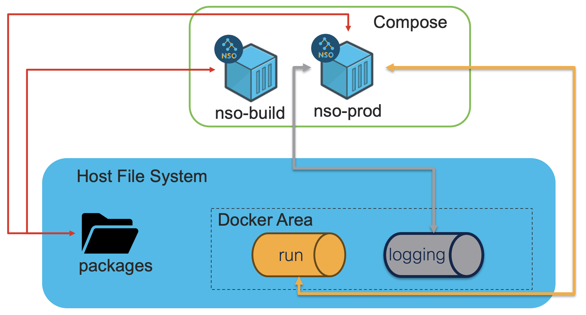

# Deploy Containerized NSO with Docker volumes and bind mounts in recomended way




## Basic Architecture:

System comprises of single instance deployment with two docker volumes each for run and logging along with bind mounts for package directory.


## 
In this example, our NSO setup contains four important docker appliances:
* **nso-prod** : A production Container with running NSO instance. It has bind mount with packages directory on host.

* **nso-dev** : It is of type **Development**, hence is only used to develop service packages and build them. It has bind mount to same packages directory that nso-prod shares.

* **run**: It is a Docker volume that contains NSO running directory which is usually found under /nso/ in a typical production containerized NSO image file structure.

* **logging**: A dedicated Docker volume shared by both nso-prod ad nso-dev that maps to /log inside Container. Since this is also a probable I/O intensive operation, it has been used with volume.

## Instructions for self-demonstrating kit:

Ensure that you are running docker engine and associated service.

Clone the repo and enter into the repo folder on your system.

In the directory ***images***, store the NSO docker images of both production and development types available from Cisco software download center of your desired NSO version. Please note that production and development images should be of same NSO version. 

Run ```make build [VER=<NSO version> (6.4.3 is default)] [ARCH=<your CPU architecture> (arm64 is default)]```, you will see following output generated and this takes a while to process:

```
% make build
docker volume create run
run
docker volume create logging
logging
rm ./nso/run/cdb/compact.lock
rm: ./nso/run/cdb/compact.lock: No such file or directory
make: [build] Error 1 (ignored)
docker container create --name dummy -v run:/nso hello-world
d2d9274ff6b4931cffe251474402be5526b8d04023451d4fe3ab50d4430c9e65
docker cp ./nso dummy:/
Successfully copied 4.45MB to dummy:/

..... truncated for brevity
```
The build target starts with loading docker images, creates volumes dummy container to copy files from host.

After it's done, run ```make start_compose```
```
% make start_compose
VER="6.4.3" docker-compose up BUILD PROD -d
[+] Running 2/2
 ✔ Container nso-build  Started      0.2s 
 ✔ Container nso-prod   Started      0.2s 
 ........
```
This will attempt to start both containers with necessary storage requirements and automatically building packages at startup of nso-dev.

Environment setup is completed successfully, you can verify by logging into the nso-prod and check if nso instance is running with all the migrated data.

##### Use cli-c to connect to nso-prod C-style NSO terminal directly from host:

```make cli-c```

##### Use cli-j to connect to nso-prod J-style NSO terminal directly from host:

```make cli-j```

##### To stop and clean the compose service:

```make stop_compose```

